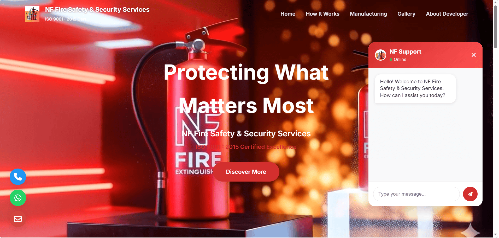
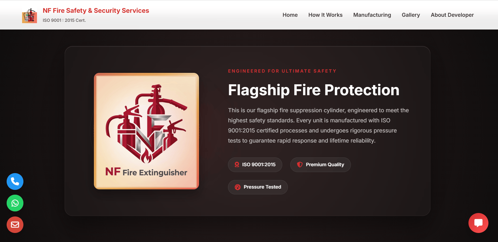

# NF Fire Extinguisher — Admin Center

  

  <a href="[https://nffire.github.io/NF-FIRE-EXTINGUISHER/](https://nffire.github.io/NF-FIRE-EXTINGUISHER-UI/)" target="_blank" rel="noopener noreferrer" style="text-decoration:none">
    
      <svg width="18" height="18" viewBox="0 0 24 24" fill="none" xmlns="http://www.w3.org/2000/svg" style="filter:drop-shadow(0 2px 4px rgba(0,0,0,0.15));">
        <path d="M5 3v18l14-9L5 3z" fill="white"/>
      </svg>
      Live Demo
    
  </a>

## Overview
NF Fire Extinguisher Admin Center is a lightweight static admin UI for managing fire extinguisher inventory, maintenance schedules, and basic safety records for company use.0

## Purpose / How the Company Uses this Software
- Inventory tracking: record serials, locations, and quantities of fire extinguishers.
- Maintenance scheduling: track inspection dates, next service due, and maintenance history.
- Reporting: generate basic reports for compliance and audits.
- Quick access UI for administrators to update records and view status.

## Who Developed This Software
- Primary developer: Harshad Teli
- Contact: harshadteli697@gmail.com

## Developer Certificates from NF Fire Extinguisher
#Certificates is coming Soon 

---
Maintainer and System Addministrator: Harshad Teli
